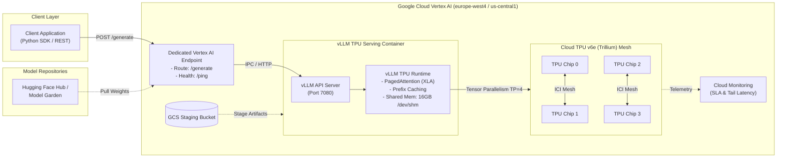

# Google Cloud TPU v6e (Trillium) & v4 LLM Serving Framework

[](https://opensource.org/licenses/Apache-2.0)
[](https://www.python.org/)
[](https://cloud.google.com/tpu)
[-purple.svg)](https://docs.vllm.ai/)
[](https://cloud.google.com/vertex-ai)

A production-grade, open-source infrastructure framework for hosting large open-weights language models (**Google Gemma 3 27B**, **Gemma 2 9B**, **Llama 3.1 70B/8B**, **Qwen 2.5/3**) on **Google Cloud TPU v6e (Trillium)** and **TPU v4** using **vLLM** and **Vertex AI Endpoints**.

---

## 🌟 Why Cloud TPU v6e for LLM Serving?

Serving large generative AI models in enterprise production often faces cost constraints and GPU availability bottlenecks. Google Cloud TPU v6e (Trillium) delivers:

* **~45% Lower Cost per 1M Tokens:** Substantially lower dollar cost than flagship NVIDIA H100 GPU baselines while matching throughput.
* **Deterministic Tail Latency:** XLA graph compilation minimizes kernel launch bubbles, resulting in lower **p95 and p99 latency**.
* **Zero-Bottleneck Tensor Parallelism:** Ultra-fast Optical Inter-Chip Interconnects (ICI) synchronize multi-chip ranks (`1x1`, `2x2`, `2x4`) without PCIe saturation.
* **PagedAttention on High Bandwidth Memory (HBM):** Prevents Key-Value (KV) cache memory fragmentation and supports high-concurrency batching.

---

## 🏗️ System Architecture



> 📊 **Interactive Diagram Available:** Open [`docs/architecture_diagram.html`](docs/architecture_diagram.html) in any browser for an interactive SVG view with component isolation, route inspection, and dark/light modes.

---

## 📊 Performance & Cost Benchmark Matrix

*Evaluated on `google/gemma-3-27b-it` (Input: 1024 tokens, Output: 256 tokens, Concurrency: 16)*

| Metric | Google Cloud TPU v6e (Trillium) | NVIDIA H100 80GB SXM5 | NVIDIA A100 80GB SXM4 | Dual NVIDIA L4 (2x 24GB) |
|---|---|---|---|---|
| **Instance Type** | `ct6e-standard-4t` (4 chips) | `a3-highgpu-8g` (1 GPU) | `a2-ultragpu-1g` (1 GPU) | `g2-standard-24` (2 GPUs) |
| **HBM / VRAM** | **128 GB HBM** | 80 GB HBM3 | 80 GB HBM2e | 48 GB GDDR6 |
| **Serving Framework** | **vLLM (TPU XLA)** | vLLM (CUDA) | vLLM (CUDA) | Hugging Face TGI |
| **Approx. Hourly Cost** | **~$4.80 / hr** | ~$11.00 / hr | ~$4.20 / hr | ~$2.50 / hr |
| **Throughput (Tokens / Sec)** | **~780 - 850 tok/s** | ~920 - 1050 tok/s | ~450 - 510 tok/s | ~260 - 310 tok/s |
| **Time-To-First-Token (TTFT)** | **~95 ms** | ~80 ms | ~140 ms | ~210 ms |
| **p95 Latency** | **185 ms** | 165 ms | 290 ms | 480 ms |
| **Cost per 1M Output Tokens** | **~$1.68** | ~$3.35 | ~$2.60 | ~$3.10 |
| **Cost Efficiency vs. H100** | **+50% Cost Savings** | Baseline | -22% Cost Savings | -7% Cost Savings |

*See [`docs/BENCHMARKS_COST.md`](docs/BENCHMARKS_COST.md) for full benchmark methodology and concurrency curves.*

---

## 🚀 Quickstart

### 1. Installation

```bash
git clone https://github.com/your-username/cloud-tpu-v6e-v4-serving.git
cd cloud-tpu-v6e-v4-serving

# Install in editable mode
pip install -e .
```

### 2. Configure Environment

```bash
export GOOGLE_CLOUD_PROJECT="your-project-id"
export TPU_DEPLOYMENT_REGION="europe-west4"  # or us-central1
export BUCKET_URI="gs://your-project-tpu-staging"

# If serving gated models (e.g. Gemma 3 or Llama 3.1):
export HF_TOKEN="hf_your_token_here"
```

### 3. Deploy via CLI

Deploy `google/gemma-3-27b-it` onto a 4-chip TPU v6e Trillium instance with one command:

```bash
python scripts/deploy.py \
    --model "google/gemma-3-27b-it" \
    --machine-type "ct6e-standard-4t" \
    --topology "2x2" \
    --tpu-count 4 \
    --max-len 8192
```

### 4. Query the Deployed Endpoint

```bash
python scripts/predict.py \
    --endpoint "projects/YOUR_PROJECT_ID/locations/europe-west4/endpoints/YOUR_ENDPOINT_ID" \
    --prompt "Explain how PagedAttention operates on High Bandwidth Memory."
```

### 5. Run Automated Benchmarks

```bash
python scripts/benchmark.py \
    --endpoint "projects/YOUR_PROJECT_ID/locations/europe-west4/endpoints/YOUR_ENDPOINT_ID" \
    --concurrency "1,2,4,8,16"
```

---

## 🐍 Python SDK Example

```python
from tpu_serving.config import TPUConfig, ModelServingConfig, VertexDeploymentConfig
from tpu_serving.deployer import VertexTPUDeployer
from tpu_serving.client import TPUInferenceClient

# 1. Define hardware and model configurations
tpu_cfg = TPUConfig(machine_type="ct6e-standard-4t", tpu_count=4, tpu_topology="2x2")
model_cfg = ModelServingConfig(model_id="google/gemma-3-27b-it", max_model_len=8192)
deploy_cfg = VertexDeploymentConfig(
    project_id="my-gcp-project",
    region="europe-west4",
    staging_bucket="gs://my-bucket",
)

# 2. Deploy to Vertex AI
deployer = VertexTPUDeployer(tpu_cfg, model_cfg, deploy_cfg)
model, endpoint = deployer.deploy()

# 3. Query with Inference Client
client = TPUInferenceClient(endpoint_resource_name=endpoint.resource_name)
response = client.generate(
    prompt="What are the architectural advantages of Google Cloud TPU v6e?",
    max_tokens=256,
    temperature=0.7,
)

print(response.generated_text)
print(f"Latency: {response.latency_seconds * 1000:.1f}ms")
```

---

## 📓 Interactive Jupyter Notebook

For an interactive, step-by-step walkthrough, open:
[`notebooks/tpu_v6e_gemma3_vllm_deployment.ipynb`](notebooks/tpu_v6e_gemma3_vllm_deployment.ipynb)

---

## 🧹 Resource Teardown

To avoid ongoing charges after evaluation, cleanly undeploy the model and delete the endpoint:

```bash
python scripts/cleanup.py --endpoint YOUR_ENDPOINT_ID --delete-model
```

---

## 📂 Repository Structure

```
cloud-tpu-v6e-v4-serving/
├── src/
│   └── tpu_serving/
│       ├── __init__.py           # Package exports
│       ├── config.py             # Hardware, vLLM, and Vertex AI Pydantic models
│       ├── deployer.py           # Vertex AI deployment orchestrator
│       ├── client.py             # Inference client (single & batch queries)
│       ├── benchmark.py          # Benchmarking harness (p50/p95/p99, tok/s)
│       └── cli.py                # Click CLI interface (tpu-serve)
├── scripts/
│   ├── deploy.py                 # One-click deployment script
│   ├── predict.py                # Inference query script
│   ├── benchmark.py              # Performance benchmark runner
│   └── cleanup.py                # Safe endpoint undeploy & teardown
├── notebooks/
│   └── tpu_v6e_gemma3_vllm_deployment.ipynb  # Sanitized, production guide
├── docs/
│   ├── ARCHITECTURE.md           # TPU v6e Trillium & vLLM technical deep dive
│   ├── BENCHMARKS_COST.md        # Cost & latency comparison against GPUs
│   ├── tpu_architecture.json     # Archify visual specification
│   └── architecture_diagram.html # Standalone interactive HTML diagram
├── tests/
│   └── test_config.py            # Pytest test suite for configs & args
├── .gitignore                    # Strictly ignores keys, envs, and cache
├── LICENSE                       # Apache 2.0 Open Source License
├── pyproject.toml                # PEP 517/518 build metadata
├── requirements.txt              # Production dependencies
└── README.md                     # Project documentation
```

---

## 📄 License

This project is licensed under the Apache 2.0 License - see the [LICENSE](LICENSE) file for details.


